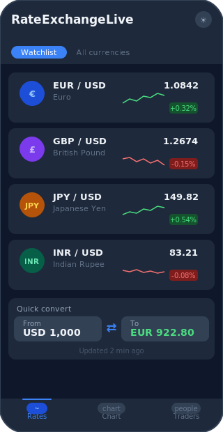
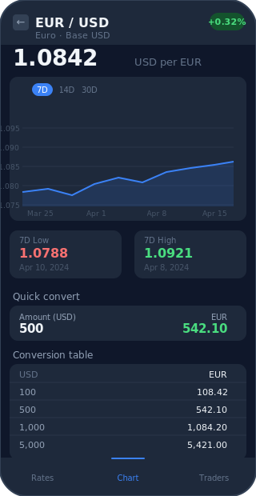
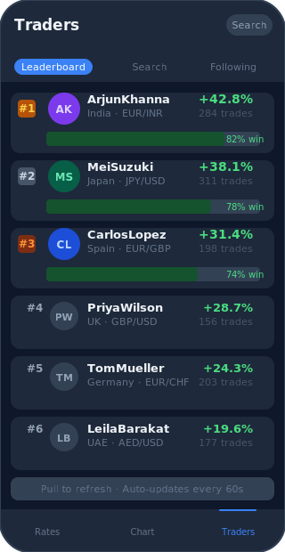
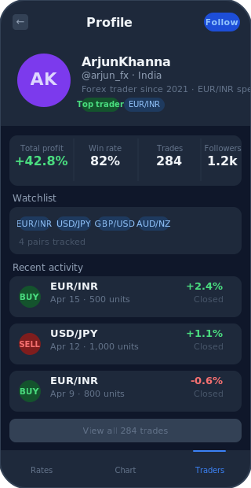

# 💱 RateExchangeLive

A real-time currency exchange rate Flutter app with a built-in converter, live rate tracking, trader profiles, and a user discovery system.

> **API powered by [currencyapi.com v3](https://currencyapi.com)**

---

## 📱 Screenshots

<table>
  <tr>
    <td align="center"><b>Home — Watchlist</b></td>
    <td align="center"><b>Detail — Chart</b></td>
    <td align="center"><b>Leaderboard</b></td>
    <td align="center"><b>User Profile</b></td>
  </tr>
  <tr>
    <td></td>
    <td></td>
    <td></td>
    <td></td>
  </tr>
  <tr>
    <td align="center">Live rates + converter</td>
    <td align="center">Price chart + quick convert</td>
    <td align="center">Top traders ranked</td>
    <td align="center">Stats, watchlist, activity</td>
  </tr>
</table>

---

## ✨ Features

- **Live Exchange Rates** — Fetches real-time rates via [currencyapi.com v3](https://currencyapi.com)
- **Currency Converter** — Convert between 25 currencies with a swap button
- **Watchlist Tab** — Track your favourite currency pairs at a glance
- **All Currencies Tab** — Browse all 25 supported currencies
- **Detail Screen** — Real price chart (7D / 14D / 30D), min/max stats, and a quick convert table per pair
- **User Profiles** — Public + trader profiles with stats, watchlist, and recent activity
- **Leaderboard** — Discover top traders ranked by total profit
- **Search** — Find traders by username, name, country, or favourite pair
- **Follow System** — Follow/unfollow traders and view your following list
- **Dark / Light Mode** — Toggle in the app bar, respects system preference
- **Auto Refresh** — Rates refresh automatically every 60 seconds
- **Pull to Refresh** — Manual refresh on any list screen

---

## 🗂 Project Structure

```
lib/
├── main.dart                  # App entry point, theme mode state
├── theme.dart                 # Light & dark ThemeData
│
├── models/
│   ├── currency.dart          # Currency & ExchangeRate models, kCurrencies list
│   └── user_profile.dart      # UserProfile & TradeActivity models, mock data
│
├── services/
│   ├── exchange_rate_service.dart   # currencyapi.com v3 calls + 5min cache
│   └── user_service.dart            # Search, leaderboard, follow logic
│
├── screens/
│   ├── home_screen.dart       # Tab bar: Watchlist + All Currencies
│   ├── detail_screen.dart     # Per-pair chart, stats, quick convert
│   └── users_screen.dart      # Leaderboard, search, following tabs
│
└── widgets/
    ├── converter_card.dart    # Currency converter widget + picker sheet
    └── rate_tile.dart         # Rate list tile + shimmer loading state
```

---

## 🚀 Getting Started

### Prerequisites

- Flutter SDK `>=3.0.0`
- Dart SDK `>=3.0.0`
- Android Studio / VS Code with Flutter plugin
- A free API key from [currencyapi.com](https://app.currencyapi.com/register)

### Installation

```bash
# 1. Clone the repository
git clone https://github.com/your-username/rateexchangelive.git
cd rateexchangelive

# 2. Install dependencies
flutter pub get

# 3. Add your API key in lib/services/exchange_rate_service.dart
#    static const String _apiKey = 'YOUR_API_KEY_HERE';

# 4. Run the app
flutter run
```

### Build for release

```bash
# Android
flutter build apk --release

# iOS
flutter build ipa --release
```

---

## 📦 Dependencies

| Package | Version | Purpose |
|--------|---------|---------|
| `http` | ^1.2.0 | API requests to currencyapi.com |
| `intl` | ^0.19.0 | Number and date formatting |
| `fl_chart` | ^0.68.0 | Price chart on the detail screen |
| `shimmer` | ^3.0.0 | Skeleton loading states |
| `shared_preferences` | ^2.2.2 | Persist user preferences locally |
| `cupertino_icons` | ^1.0.6 | iOS-style icons |

---

## 🌐 API

Rates are fetched from **[currencyapi.com](https://currencyapi.com) v3**:

### Setup

1. Register for a free API key at [app.currencyapi.com](https://app.currencyapi.com/register)
2. Open `lib/services/exchange_rate_service.dart`
3. Replace the placeholder with your key:

```dart
static const String _apiKey = 'YOUR_API_KEY_HERE';
```

### Endpoints used

| Endpoint | URL | Purpose |
|----------|-----|---------|
| Latest rates | `GET /v3/latest` | Home screen & converter |
| Historical rates | `GET /v3/historical` | Detail screen chart |

### Example requests

```
# Latest rates
GET https://api.currencyapi.com/v3/latest
    ?apikey=YOUR_KEY
    &base_currency=USD
    &currencies=EUR,GBP,JPY,INR

# Historical rate for a specific date
GET https://api.currencyapi.com/v3/historical
    ?apikey=YOUR_KEY
    &base_currency=USD
    &currencies=EUR
    &date=2024-03-01
```

### Response format

```json
{
  "meta": { "last_updated_at": "2024-03-01T23:59:59Z" },
  "data": {
    "EUR": { "code": "EUR", "value": 0.9234 },
    "GBP": { "code": "GBP", "value": 0.7891 }
  }
}
```

### Caching & refresh

- Responses are cached in memory for **5 minutes** to reduce API calls
- Rates auto-refresh in the background every **60 seconds**
- Pull-to-refresh triggers an immediate re-fetch and clears the cache

### Free plan limits

| Feature | Free tier |
|---------|-----------|
| Monthly requests | 300 |
| Update frequency | Daily |
| Historical data | Yes |
| Base currency switch | Yes |

Upgrade at [currencyapi.com/pricing](https://currencyapi.com/pricing) for higher limits and hourly updates.

---

## 👤 User Profiles

The app includes a complete user discovery system:

- **Public profile** — display name, avatar, bio, country, join date
- **Trader profile** — win rate, total trades, profit %, favourite pairs, watchlist
- **Recent activity** — last trades with direction (buy/sell) and profit
- **Leaderboard** — ranked by total profit percentage
- **Search** — filter by username, name, country, or currency pair
- **Follow system** — follow/unfollow with live follower count updates

> **Note:** User data is currently mocked in `lib/models/user_profile.dart`. To connect a real backend, replace the methods in `UserService` with your API calls.

---

## 🛠 Customisation

### Add a new currency

Open `lib/models/currency.dart` and add to the `kCurrencies` list:

```dart
Currency(code: 'PKR', name: 'Pakistani Rupee', flag: '🇵🇰', symbol: '₨'),
```

### Change the watchlist defaults

In `lib/screens/home_screen.dart`, edit the `_watchlist` list:

```dart
final List<String> _watchlist = [
  'EUR', 'GBP', 'JPY', 'CAD', 'AUD', ...
];
```

### Connect a real user backend

Replace the methods in `lib/services/user_service.dart`:

```dart
Future<List<UserProfile>> getLeaderboard() async {
  final response = await http.get(Uri.parse('https://your-api.com/users/leaderboard'));
  // parse and return
}
```

### Use real historical chart data

The detail screen already calls `getHistoricalRates()` which hits `/v3/historical` on currencyapi.com. Just make sure your API key is set and the chart will display real data automatically.

> Note: the free plan allows 300 requests/month. Fetching 30 days of history costs 30 requests per pair — limit the default chart range to 7D on free plans.

---

## 🤝 Contributing

1. Fork the repository
2. Create a feature branch — `git checkout -b feature/your-feature`
3. Commit your changes — `git commit -m 'Add your feature'`
4. Push to the branch — `git push origin feature/your-feature`
5. Open a Pull Request

---

## 📄 License

This project is licensed under the MIT License. See the [LICENSE](LICENSE) file for details.

---

## 🙏 Acknowledgements

- [currencyapi.com](https://currencyapi.com) — Real-time & historical exchange rate API
- [fl_chart](https://pub.dev/packages/fl_chart) — Beautiful Flutter charts
- [Flutter](https://flutter.dev) — Cross-platform mobile framework
